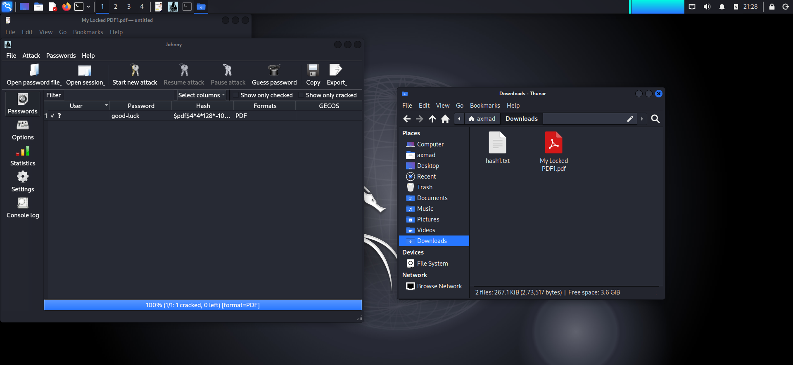
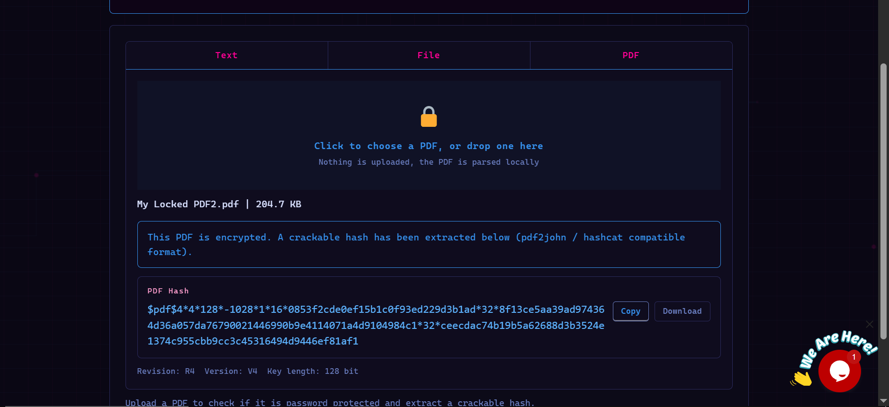
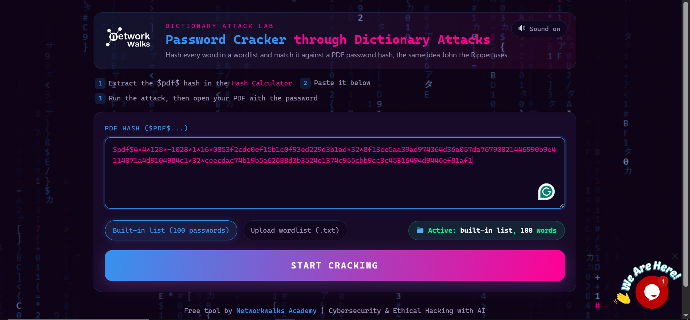
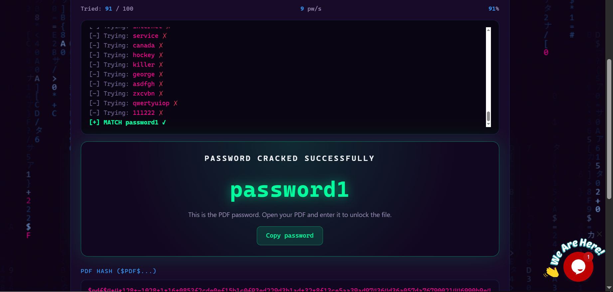

# 🔐 NetworkWalks Cybersecurity Internship — Batch 083
## Week 3: Password Cracking

> Hands-on password cracking using John the Ripper (Johnny GUI) and the NetworkWalks web-based Dictionary Attack Lab.

---

## 📋 Tasks This Week

| Task | Description | Tool Used | Status |
|------|-------------|-----------|--------|
| Task 1 | Crack a password-protected PDF using John the Ripper | Johnny (JtR GUI) + pdf2john | ✅ Cracked |
| Task 2 | Extract PDF hash and crack it via Dictionary Attack Lab | NetworkWalks Hash Calculator + Password Cracker | ✅ Cracked |

---

## 🛠️ Tools Used

- **John the Ripper (JtR)** — Industry-standard open-source password cracker
- **Johnny** — GUI frontend for John the Ripper (used on Linux/Kali)
- **pdf2john** — Extracts crackable hashes from password-protected PDF files
- **NetworkWalks Hash Calculator** — Web tool to extract PDF hashes (pdf2john / hashcat compatible)
- **NetworkWalks Dictionary Attack Lab** — Web-based password cracker using dictionary attacks

---

## 📁 Repo Structure

```
NETWORKWALKS-B083-WK3-PASSWORD-CRACKING/
├── README.md
├── task1/
│   ├── screenshot1.png   ← Johnny showing cracked password + hash
│   └── screenshot2.png   ← Unlocked PDF with captured flag
└── task2/
    ├── screenshot1.png   ← Hash Calculator extracting PDF hash
    ├── screenshot2.png   ← Hash pasted into Dictionary Attack Lab
    ├── screenshot3.png   ← Attack running, password matched
    └── screenshot4.png   ← Unlocked PDF with second flag
```

---

## 🧪 Task 1 — Cracking a Locked PDF using John the Ripper (Johnny GUI)

### Process

1. Obtained a password-protected PDF: `My Locked PDF1.pdf`
2. Used `pdf2john` to extract the hash from the PDF and saved it as `hash1.txt`
3. Opened **Johnny** and loaded `hash1.txt` as the password file
4. Started a dictionary attack using John the Ripper's default wordlist
5. JtR successfully cracked the hash and revealed the password

### Result

| Field | Value |
|-------|-------|
| File | `My Locked PDF1.pdf` |
| Hash Format | PDF |
| Password Cracked | `good-luck` |
| Flag Captured | `nw(cybersecurity_flag_captured_2608)` |

### Screenshots

**Johnny GUI — Hash loaded, password cracked (100% complete)**



**Unlocked PDF — Flag revealed**


---

## 🌐 Task 2 — Hash Calculator + Dictionary Attack Lab (NetworkWalks Web Tools)

### Process

1. Obtained a second password-protected PDF: `My Locked PDF2.pdf`
2. Uploaded it to the **NetworkWalks Hash Calculator** (PDF tab) — hash extracted client-side, nothing uploaded to a server
3. Copied the extracted PDF hash (`$pdf$4*4*128*...`)
4. Navigated to the **Dictionary Attack Lab** and pasted the hash
5. Selected the built-in 100-password wordlist and started the attack
6. Attack ran at ~9 passwords/sec, matched the correct password at attempt 91/100
7. Used the cracked password to open the PDF and retrieve the flag

### Result

| Field | Value |
|-------|-------|
| File | `My Locked PDF2.pdf` |
| Hash Revision | R4 |
| Hash Version | V4 |
| Key Length | 128-bit |
| Wordlist Used | Built-in (100 passwords) |
| Match Found At | Entry 91 / 100 |
| Password Cracked | `password1` |
| Flag Captured | `nw{networkwalks_persistence_jtr_270521}` |

### Screenshots

**NetworkWalks Hash Calculator — PDF hash extracted**



**Dictionary Attack Lab — Hash pasted, attack ready**



**Attack running — Password matched at entry 91**



**Unlocked PDF — Second flag revealed**


---

## 🔍 Findings & Takeaways

- **Dictionary attacks are fast and effective against weak passwords.** Both PDFs were cracked using small, common wordlists in seconds.
- **`good-luck` and `password1` are real-world weak passwords** that appear in most standard wordlists -- exactly the type of credentials attackers target first.
- **pdf2john bridges the gap** between an encrypted file and a crackable hash -- understanding this workflow is fundamental to offline password attacks.
- **The NetworkWalks tools demonstrate the same logic JtR uses** -- hash every word in a wordlist, compare against the target hash, stop when there's a match.
- **Key mindset:** Password security is only as strong as the password itself. Encryption doesn't help if the key is `password1`.

---

## 🏁 Flags Captured

| Task | Flag |
|------|------|
| Task 1 | `nw(cybersecurity_flag_captured_2608)` |
| Task 2 | `nw{networkwalks_persistence_jtr_270521}` |

---

## 🎓 Internship Details

| Field | Info |
|-------|------|
| Program | NetworkWalks Cybersecurity Internship |
| Batch | 083 |
| Week | 3 — Password Cracking |
| Platform | NetworkWalks Academy |
